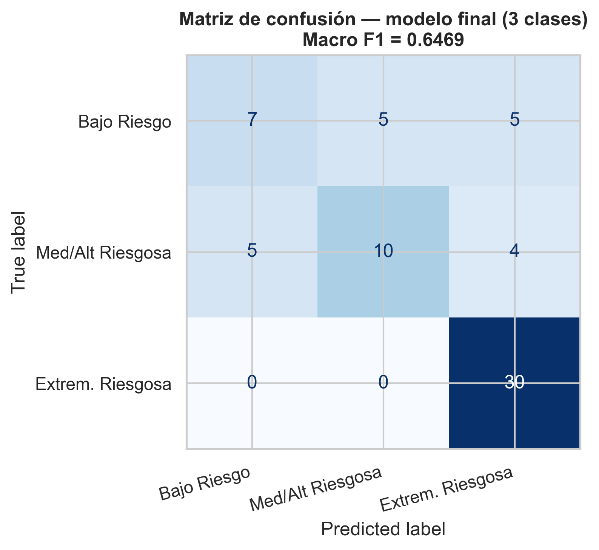
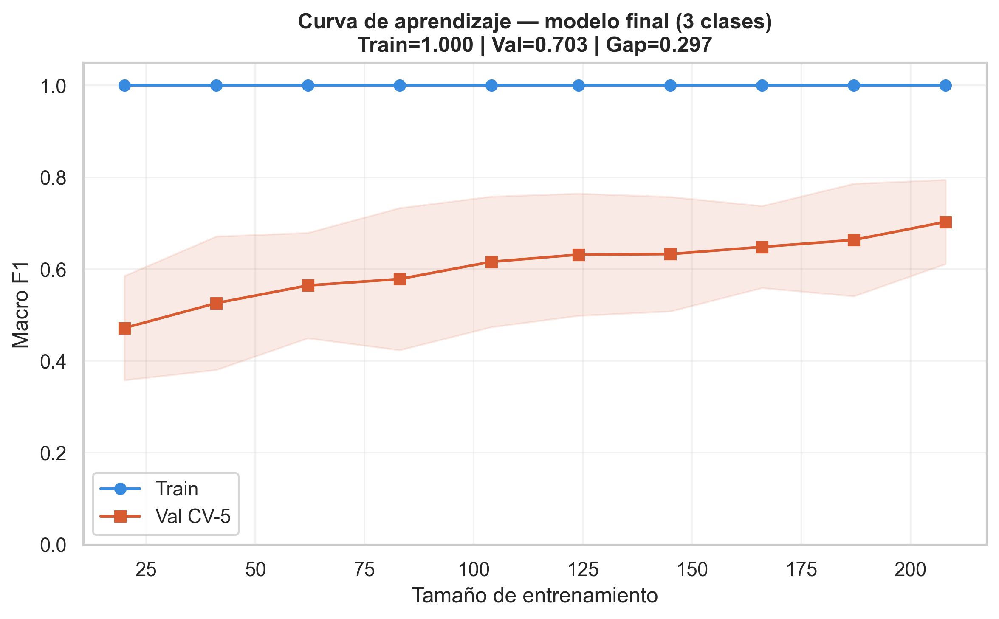
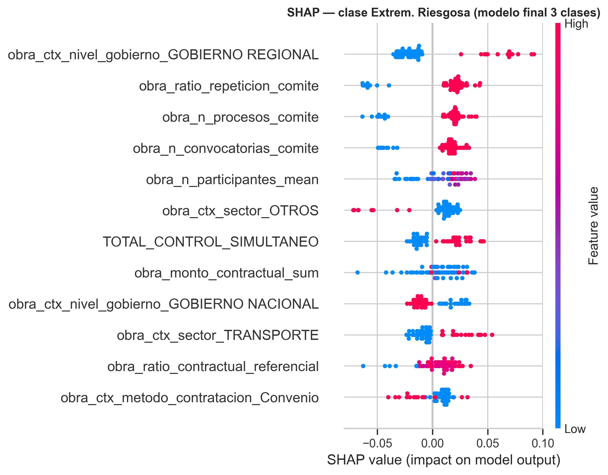
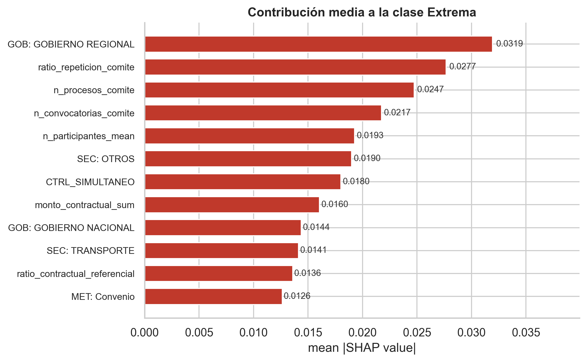
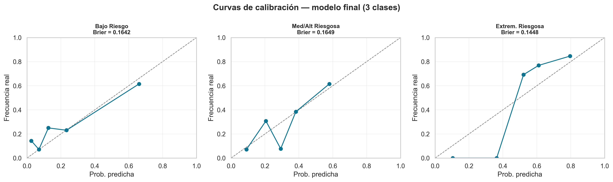
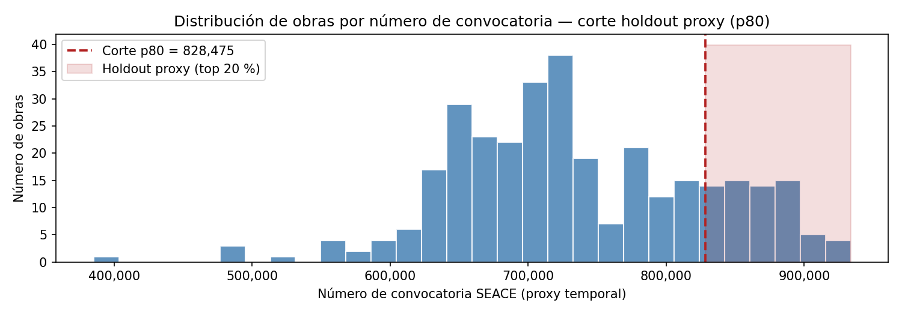
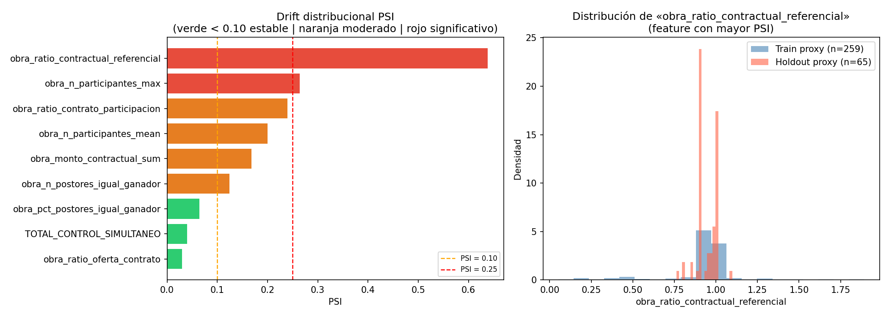
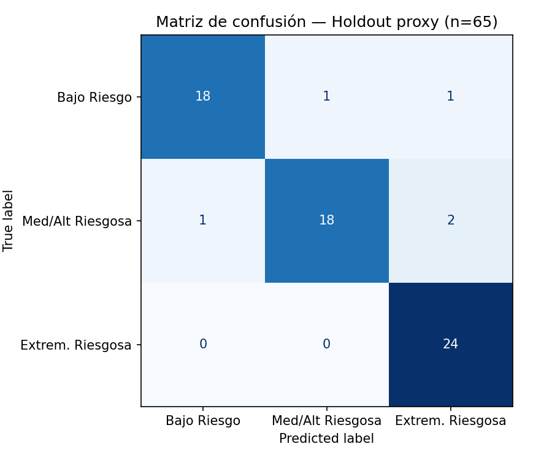
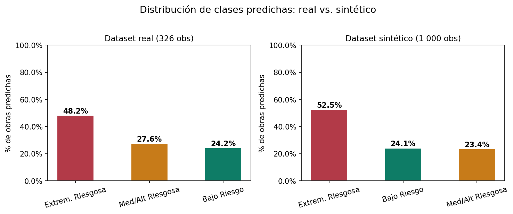

# Sistema de Detección y Priorización de Riesgos de Corrupción en Obras Públicas — ML

> **Tesis de Maestría en Inteligencia Artificial**  
> Universidad Nacional de Ingeniería — FIIS · Lima, Perú  
> Autores: Fernando García Atúncar · Hilario Aradiel Castañeda

---

## Problema que se aborda

El sistema de control gubernamental en el Perú opera predominantemente de forma **reactiva y posterior**: las irregularidades en obras públicas se detectan, en el mejor de los casos, cuando el daño ya ocurrió. La Contraloría General de la República (CGR) debe priorizar manualmente cientos de obras con recursos limitados, sin un criterio sistemático basado en señales de riesgo tempranas.

Este proyecto construye un sistema basado en **Machine Learning y Explainable AI (XAI)** que, a partir de datos observables de la fase de Selección (contrataciones, postores, comité, montos, control CGR), predice el nivel de riesgo de corrupción de una obra pública **antes** de que ocurran irregularidades, permitiendo priorizar el control preventivo.

---

## Hipótesis de investigación

| # | Hipótesis |
|---|-----------|
| H1 | Existe un conjunto de factores observables (económicos, de competencia, comité de selección y supervisión CGR) que permiten discriminar estadísticamente los niveles de riesgo de corrupción en obras públicas. |
| H2 | Un modelo Random Forest entrenado sobre datos CGR alcanza **Macro F1 ≥ 0.60** y **Recall clase Extrema ≥ 0.90**, superando el baseline aleatorio estratificado. |
| H3 | El modelo generaliza a datos no vistos en condiciones de distribución similar a las del entrenamiento (validación fuera de muestra). |

---

## Objetivos específicos (fortalecidos — Semana 10)

| OE | Enunciado | Criterio de aceptación |
|----|-----------|------------------------|
| **OE1** | Identificar y caracterizar los factores observables asociados al riesgo de corrupción en la fase de Selección, mediante análisis exploratorio y feature engineering sobre 8 fuentes CGR. | ≥ 60 features construidas con VIF < 10 y correlación inter-feature < 0.85; al menos 3 dominios de riesgo identificados (económico, competencia, comité). |
| **OE2** | Construir y validar experimentalmente un modelo ML con capacidad de detección suficiente para priorización operacional. | Macro F1 ≥ 0.60 · Recall Extrema ≥ 0.90 · Brier Extrema < 0.20 en holdout estratificado 80/20. |
| **OE3** | Evaluar la generalización del modelo fuera de muestra y prototipar un sistema operacional de apoyo a la fiscalización basada en riesgo. | Macro F1 ≥ 0.55 en validación externa · API funcional · Dashboard con explicaciones por obra. |

---

## Metodología

### Pipeline experimental

```
[NB00] EDA + limpieza de 8 fuentes CGR
         │
         ▼
[NB02] Construcción del dataset obra_v4
         │  326 obras × 77 features iniciales
         ▼
[NB03] Baseline RF 4 clases (Macro F1 = 0.5939)
         │
         ▼
[NB05] A/B experiments — comparación de variantes
         │
         ▼
[NB06] SHAP + calibración del baseline
         │
         ▼
[NB07] Reducción anti-colinealidad (77→61 features)
         │  + fusión a 3 clases (OE2 variante Var5)
         ▼
[NB08] Modelo final RF 3 clases  ◄── MODELO OFICIAL
         │  Macro F1 = 0.6469 · Recall Extrema = 1.00
         ▼
[NB10] Holdout temporal proxy (Opción B, OE3)
         │
         ▼
[NB11] Datos sintéticos placeholder (Opción A pending)
```

### Unidad de análisis

```
1 fila = 1 obra pública  (clave: IDENTIFICADOR_OBRA)
```

### Target

| Clase | Descripción | Fusión aplicada |
|-------|-------------|-----------------|
| 0 — Bajo Riesgo | Obras sin señales de riesgo relevantes | Clases originales 0 + 1 fusionadas |
| 1 — Med/Alt Riesgosa | Riesgo moderado a alto | Clase original 2 |
| 2 — Extrem. Riesgosa | Señales de riesgo extremo | Clase original 3 |

La fusión a 3 clases (decisión Var5, NB07) incrementó el Macro F1 en +6.3 pp respecto al modelo de 4 clases, sin pérdida de capacidad discriminativa en la clase de mayor interés operacional.

---

## Dataset

| Atributo | Valor |
|----------|-------|
| Fuente | 8 datasets CGR (`o1a` … `o5a`, fuentes de obra, empresa, comité, control) |
| Observaciones | **326 obras públicas** (año 2023, Perú) |
| Features iniciales | 77 (NB02) |
| Features tras anti-colinealidad | **61** (VIF < 10, correlación < 0.85, NB07) |
| Features eliminadas | 16 (redundancia estadística, sin pérdida predictiva) |
| Cobertura temporal | Enero–Agosto 2023 (proxy: CONVOCATORIA_PROCESO_GANADO) |
| Archivo | `data/processed/dataset_obra_v4_model.parquet` |

### Dominios de features

```
┌─────────────────────────────┬──────────────────────────────────────────────────────┐
│ Dominio                     │ Ejemplos                                             │
├─────────────────────────────┼──────────────────────────────────────────────────────┤
│ Proceso de selección        │ n_participantes, n_convocatorias_comite, n_postores   │
│ Competencia económica       │ ratio_oferta_contrato, ratio_contractual_referencial  │
│ Comité de selección         │ ratio_repeticion_comite, comite_no_estandar           │
│ Supervisión CGR             │ TOTAL_CONTROL_PREVIO/SIMULTANEO/POSTERIOR             │
│ Ejecución contractual       │ brecha_mean, ratio_real_plan, obra_paralizada         │
│ Contexto institucional      │ sector, nivel_gobierno, departamento, metodo_contrat. │
└─────────────────────────────┴──────────────────────────────────────────────────────┘
```

---

## Evolución experimental y selección del modelo

| Experimento | Algoritmo | Features | Clases | Macro F1 | Decisión |
|-------------|-----------|----------|--------|----------|----------|
| Baseline | RF | 77 | 4 | 0.5939 | Referencia |
| Var1 | LightGBM | 77 | 4 | 0.5524 | Descartado |
| Var3 | RF anti-col. | 61 | 4 | 0.6087 | +2.5 pp → adoptar |
| Var4 | RF + SMOTE | 61 | 4 | 0.6139 | +0.85 pp → pendiente |
| **Var5** | **RF anti-col.** | **61** | **3** | **0.6469** | **+6.3 pp → MODELO FINAL** |

> El experimento multi-entidad (obra + empresa + funcionario, `dataset_maestro_v2`) se evaluó y descartó por rendimiento inferior (Macro F1 = 0.226 vs. 0.594 solo-obra), documentado en `data/processed/experimentos/`.

---

## Resultados del modelo final (OE2)

**Artefacto:** `models/obra_v4/pipeline_rf_obra_3clases_final.pkl`  
**Configuración:** RandomForestClassifier · seed=42 · n_train=260 · n_test=66 · 3 clases

| Métrica | Valor | Umbral OE2 | ¿Cumple? |
|---------|-------|------------|----------|
| Macro F1 | **0.6469** | ≥ 0.60 | ✔ |
| Balanced Accuracy | **0.6460** | — | — |
| Recall Extrem. Riesgosa | **1.0000** | ≥ 0.90 | ✔ |
| Brier Extrem. Riesgosa | **0.1448** | < 0.20 | ✔ |
| Gap train–val | 0.2971 | — | (sobreajuste moderado, esperado en RF/n=326) |

**Los tres criterios de aceptación de OE2 se cumplen.**

### Matriz de confusión (holdout, n=66)



### Curvas de aprendizaje



### SHAP — factores explicativos (clase Extrema)

El análisis TreeSHAP identifica los factores con mayor contribución a la predicción de riesgo extremo:




Las variables de mayor peso predictivo corresponden a:
- **Comité de selección:** repetición de miembros, número de convocatorias y procesos
- **Competencia:** número de participantes, ratio oferta/contrato
- **Supervisión CGR:** controles previos y simultáneos registrados
- **Montos:** monto contractual total, ratio contrato/referencial

### Calibración probabilística



---

## Validación fuera de muestra (OE3 — Plan de generalización)

### Opción B — Holdout temporal proxy (NB10, implementado)

Al no existir una columna de fecha explícita en el dataset procesado, se usó `CONVOCATORIA_PROCESO_GANADO` (ID secuencial SEACE) como proxy del orden temporal. Las 326 obras se ordenaron por este proxy y se partieron en p80 (train proxy: 261) / p20 (holdout proxy: 65).

| Métrica | CV interno | Holdout proxy (n=65) | Δ | Umbral OE3 | ¿Cumple? |
|---------|-----------|----------------------|---|------------|----------|
| Macro F1 | 0.6469 | **0.9214** | +0.275 | ≥ 0.55 | ✔ |
| Balanced Accuracy | 0.6460 | 0.9190 | +0.273 | — | — |
| Recall Extrem. Riesgosa | 1.0000 | **1.0000** | 0.0 | ≥ 0.85 | ✔ |
| Brier Extrem. Riesgosa | 0.1448 | 0.0533 | −0.091 | < 0.20 | ✔ |

> El rendimiento en el holdout proxy es **superior** al CV interno. Esto es indicativo (no concluyente): el ID secuencial puede no ser un proxy temporal perfecto. Se requiere confirmación con la Opción A.

**Análisis de drift PSI** (top-10 features): 3 estables, 4 moderadas, 2 significativas — atribuido principalmente a la distribución desigual de obras por segmento temporal en el dataset de 326 observaciones.





### Opción A — Holdout externo real (PENDIENTE)

La validación definitiva de OE3 requiere:
1. Descarga de datos CGR reales 2024/2025 (INFOBRAS/SEACE).
2. Procesamiento con el pipeline `NB00 → NB02` sobre los nuevos datos.
3. Aplicación del modelo congelado (sin reentrenar).
4. Cálculo de métricas con etiquetas reales.

Como placeholder hasta obtener esos datos, NB11 genera 1 000 observaciones sintéticas (bootstrap + ruido gaussiano σ×10%) y evalúa la estabilidad de las predicciones:

| Dataset | % Bajo Riesgo | % Med/Alt | % Extrem. |
|---------|--------------|-----------|-----------|
| Real (326 obs) | 24.2% | 27.6% | 48.2% |
| Sintético (1 000 obs) | 24.1% | 23.4% | 52.5% |



La distribución de predicciones es estable, lo que indica que el modelo es robusto frente a perturbaciones de ruido aleatorio.

---

## Sistema operacional (OE3 — prototipo)

### API de inferencia (FastAPI)

```
make serve   →   http://localhost:18000
```

| Endpoint | Descripción |
|----------|-------------|
| `GET /health` | Estado del servicio y modelo cargado |
| `GET /model_meta` | Metadata, métricas y estadísticas de features |
| `GET /obras` | Lista de las 326 obras del dataset |
| `GET /obras/{id}` | Fila completa de una obra (61 features) |
| `POST /predict_proba` | Predicción multi-clase con probabilidades |
| `POST /predict_batch` | Predicción en lote (CSV) |
| `POST /explain` | Explicación TreeSHAP por obra |

### Dashboard web (React 18 + Vite + Tailwind)

```
cd apps/frontend && npm install && npm run dev   →   http://localhost:5173
```

Cuatro pestañas operacionales:

| Pestaña | Función |
|---------|---------|
| **Explorar obra** | Selecciona cualquiera de las 326 obras reales, ve sus atributos en lenguaje auditor y obtiene predicción + explicación SHAP |
| **Modo manual** | Ajusta los principales drivers con sliders y observa cómo cambia la predicción (análisis "qué pasaría si") |
| **Carga CSV** | Sube un CSV con obras nuevas y descarga el resultado con columnas de riesgo añadidas |
| **Métricas del modelo** | Panel permanente con Macro F1, Balanced Accuracy, Recall Extrema y Brier del modelo oficial |

### Demo Streamlit (alternativa sin red)

```
streamlit run demo/demo_app.py
```

Carga el `.pkl` directamente sin pasar por la API. Útil como respaldo en presentaciones.

### Docker (producción)

```
docker compose -f docker-compose.prod.yml up --build -d
```

| Servicio | Puerto | Tecnología |
|----------|--------|------------|
| API | 18000 | gunicorn + uvicorn |
| Dashboard | 18080 | nginx (build estático) |

---

## Estado actual del proyecto

| Componente | Estado | Evidencia |
|------------|--------|-----------|
| Dataset obra_v4 (326 obs × 61 features) | ✔ Completo | `data/processed/dataset_obra_v4_model.parquet` |
| Feature engineering (8 fuentes CGR) | ✔ Completo | `NB00`, `NB02` |
| Selección de modelo y variantes A/B | ✔ Completo | `NB03`, `NB05`, log `metrics_experimentos.csv` |
| SHAP + calibración | ✔ Completo | `NB06`, `NB08`, `reports/figures/` |
| Modelo final 3 clases (OE2) | ✔ Completo | `pipeline_rf_obra_3clases_final.pkl` · F1=0.6469 |
| API de inferencia (7 endpoints) | ✔ Completo | `src/api/` · `make test` pasa |
| Dashboard web (4 pestañas) | ✔ Completo | `apps/frontend/` · verificado en navegador |
| Holdout temporal proxy (OE3 — Opción B) | ✔ Completo | `NB10` · F1=0.9214 en 65 obras |
| Datos sintéticos placeholder | ✔ Completo | `NB11` · 1 000 filas generadas |
| **Holdout externo real (OE3 — Opción A)** | **Pendiente** | Requiere datos CGR 2024/2025 |
| Plan de validación por grupo/región | Pendiente | Definido en Matriz de Consistencia |

---

## Estructura del repositorio

```
.
├── notebooks/                   ← Pipeline experimental (fuente de verdad del modelado)
│   ├── 00_eda_inicial.ipynb
│   ├── 02_build_dataset_obra_v4.ipynb
│   ├── 03_train_obra_v4.ipynb
│   ├── 05_ab_experiments_obra_v4.ipynb
│   ├── 06_shap_calibration_obra_v4.ipynb
│   ├── 07_var3_anticol_obra_v4.ipynb
│   ├── 08_modelo_final_obra_v4.ipynb     ← modelo oficial
│   ├── 10_validacion_holdout_temporal_proxy.ipynb
│   └── 11_datos_sinteticos_opcA_placeholder.ipynb
│
├── models/obra_v4/
│   ├── pipeline_rf_obra_3clases_final.pkl     ← artefacto oficial
│   └── pipeline_rf_obra_3clases_final_meta.json
│
├── src/api/                     ← capa de serving (FastAPI)
│   ├── main.py
│   ├── deps.py
│   ├── schemas.py
│   ├── explain.py
│   └── routes/
│
├── apps/frontend/               ← dashboard React/Vite
├── demo/demo_app.py             ← demo Streamlit (standalone)
│
├── data/
│   ├── external/                ← extractos crudos por dominio
│   ├── interim/                 ← parquet limpios (obra)
│   └── processed/               ← datasets finales
│
├── logs/                        ← métricas y figuras de experimentos
└── reports/figures/             ← visualizaciones del pipeline
```

---

## Cómo ejecutar

**Requisitos:** Python 3.11 · Node.js 20 · venv en `.venv/`

```bash
# Backend
make install      # instala dependencias Python
make test         # ejecuta suite de tests (pytest)
make serve        # API en http://localhost:18000

# Frontend
cd apps/frontend
npm install
npm run dev       # dashboard en http://localhost:5173

# Demo Streamlit
streamlit run demo/demo_app.py

# Docker producción
docker compose -f docker-compose.prod.yml up --build -d
# API → http://localhost:18000 · Dashboard → http://localhost:18080
```

---

## Próximo paso: Opción A (validación externa real)

La consolidación de OE3 requiere ejecutar el modelo sobre datos CGR **fuera del período de entrenamiento (2023)**:

1. Descargar datos INFOBRAS/SEACE de obras 2024–2025.
2. Ejecutar `NB00 → NB02` sobre los nuevos datos crudos.
3. Aplicar el modelo congelado (`pipeline_rf_obra_3clases_final.pkl`) sin reentrenar.
4. Calcular Macro F1, Recall Extrema y Brier con las etiquetas reales disponibles.
5. Comparar PSI por feature para cuantificar el drift entre períodos.

Este paso reemplazará el notebook NB11 (placeholder sintético) con evidencia de generalización real.

---

## Tecnologías

| Capa | Tecnología |
|------|-----------|
| Lenguaje | Python 3.11 |
| ML | scikit-learn, joblib |
| XAI | SHAP (TreeExplainer) |
| API | FastAPI, uvicorn, gunicorn |
| Frontend | React 18, Vite, Tailwind CSS, recharts |
| Demo | Streamlit |
| Contenerización | Docker, nginx |
| Versionamiento | Git, GitHub, GitLab |
| Análisis | pandas, numpy, matplotlib, seaborn |

---

*Repositorio de investigación — Maestría en IA, UNI-FIIS · 2026*
